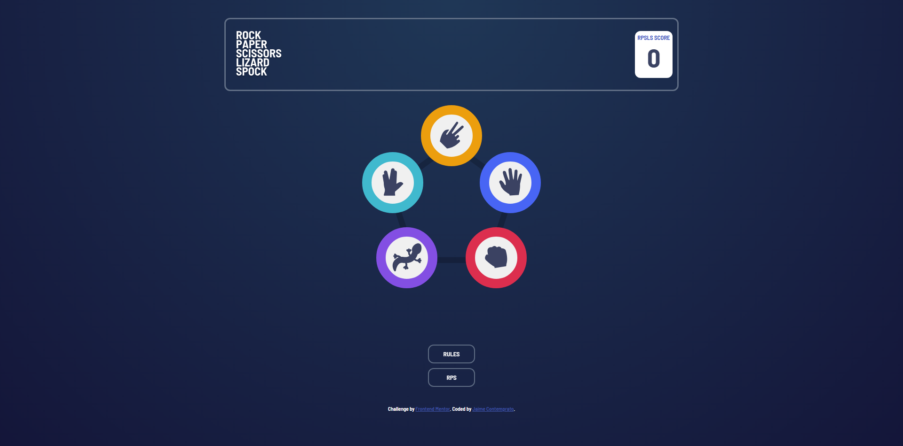

# Frontend Mentor - Rock, Paper, Scissors solution

This is a solution to the [Rock, Paper, Scissors challenge on Frontend Mentor](https://www.frontendmentor.io/challenges/rock-paper-scissors-game-pTgwgvgH). Frontend Mentor challenges help you improve your coding skills by building realistic projects.

## Table of contents

- [Overview](#overview)
  - [The challenge](#the-challenge)
  - [Screenshot](#screenshot)
  - [Links](#links)
- [My process](#my-process)
  - [Built with](#built-with)
  - [What I learned](#what-i-learned)
  - [Continued development](#continued-development)
  - [Useful resources](#useful-resources)
- [Author](#author)

## Overview

### The challenge

Users should be able to:

- View the optimal layout for the game depending on their device's screen size
- Play Rock, Paper, Scissors against the computer
- Maintain the state of the score after refreshing the browser _(optional)_
- **Bonus**: Play Rock, Paper, Scissors, Lizard, Spock against the computer _(optional)_

### Screenshot




### Links

- Solution URL: [My Rock, Paper, Scissors App Repo](https://github.com/Jaime-Cont/rock-paper-scissors-app)
- Live Site URL: [My Rock, Paper, Scissors App hosted by Github Pages](https://jaime-cont.github.io/rock-paper-scissors-app/)

## My process

- I started off by setting up my React components, thinking what components I needed and then setting up each of them so I can put in their HTML elements once ready and after I've finalized my thought process on how to tackle the challenge.
- I proceeded to plot down all the basic HTML Elements, setting up the main element, sections and divs that I deemed necessary to accomplish the challenge within their respective Component tsx files.
- I proceeded to initialize my CSS Variables for easier color application and setting the main font size and weight, all according to the challenge's specifications incorporating mobile first.
- I setup the font-styles for reusability.
- I would work on HTML, CSS and React in an alternating matter to match the output, until I was satisfied with the front end side of things.
- I then proceeded to work on JavaScript and TypeScript, initializing the functions and HTMLElements connected to all the elements I want the scripts and functions to affect.
- I then worked on assigned the correct functions to the respective buttons I planned on doing the functions, each with their own functionality and some similar to others using reusable code/functions.
- I then worked on animations to make the feel of the app more alive, setting up keyframes and adding them to the HTMLElements and functions when clicked or hovered.
- Worked on media query on Tablet after I was happy with Mobile, then later moved to Desktop
- Trial and Error till I got the output I was looking for.

### Built with

- HTML
- CSS
- JavaScript
- TypeScript
- Responsive Media Queries
- Flexbox
- Mobile-first workflow
- [React](https://reactjs.org/) - JS library
- [Vite](https://vite.dev/)

### What I learned

- I'm happy to be improving and noticing that I work better now compared to my older projects, I'm faster at thinking of what I need to include and how to implement them to provide the correct output.
- I got to make a project using TypeScript and React which made me quite happy that my tech stack is growing and improving with each project!
- I learned how to use Import, Export and Create React components and it was so fun to learn and add to my growing knowledge.
- I learned how to declare HTML Elements in TypeScript
- I learned how to create functions in React files
- I learned how to use onClick functions in React

```js
const ChooseRock = () => {
  choice = 0;
  RefreshScore();
  ChangeBoardToResults();
  RevealPlayerChoiceRock();
  RevealAIChoice();
};
```

```React
import Header from "./components/header";
import RPSBoard from "./components/rps-gameboard";
import RPSLSBoard from "./components/rpsls-gameboard";
import Footer from "./components/footer";
import RPSRules from "./components/rps-rules";
import RPSLSRules from "./components/rpsls-rules";

function App() {
  return (
    <>
      <main>
        <Header />
        <RPSRules />
        <div className="rules-bg" id="rulesBG"></div>
        <RPSLSRules />
        <RPSBoard />
        <RPSLSBoard />
      </main>

      <Footer />
    </>
  );
}

export default App;
```

```ts
let rpsButtons = document.getElementById("rps-buttons");
let rpsResults = document.getElementById("rps-results");

if (rpsButtons && rpsResults) {
  rpsButtons.style.animationName = "boardToLeftButtons";
  rpsButtons.style.animationDuration = "0.5s";
  rpsButtons.style.animationFillMode = "forwards";

  rpsResults.style.animationName = "boardToMiddleFromLeftResults";
  rpsResults.style.animationDuration = "0.5s";
  rpsResults.style.animationFillMode = "forwards";
}
```

### Continued development

If I were to continue development on this website I would try to find a way to solve the bonus optional challenge of having the score stay the same even when refreshing the browser, and probably more gamemodes! the harder the more fun it is!

I would also incorporate React hooks for better functionality.

### Useful resources

- [React onClick Events](https://blog.logrocket.com/react-onclick-event-handlers-guide/) - This helped me learn how to do onClick events when using React which really helped a lot since I had a lot of buttons in my app.
- [TypeScript HTMLElement Declaration](https://stackoverflow.com/questions/14742194/declaring-an-htmlelement-typescript) - This helped me learn how to do HTMLElement Declaration when using TypeScript and avoid errors where it says some elements may be null.
- [Deploying Vite / React App to GitHub Pages](https://dev.to/rashidshamloo/deploying-vite-react-app-to-github-pages-35hf) - This helped me learn how to deploy a Vite React application to GitHub Pages.

## Author

- Github - [Jaime Contemprato](https://github.com/Jaime-Cont)
- Frontend Mentor - [@Jaime-Cont](https://www.frontendmentor.io/profile/Jaime-Cont)
- LinkedIn - [Jaime Contemprato](https://www.linkedin.com/in/jm-contemprato/)
